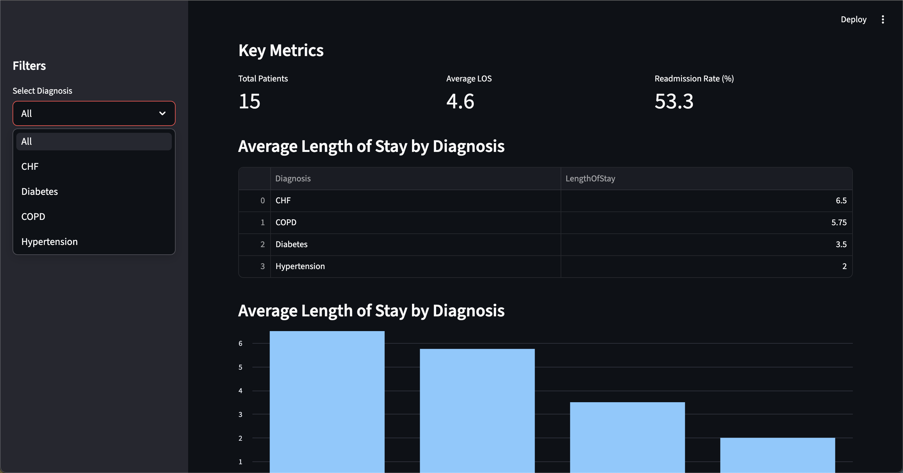

# Healthcare SQL Analytics Dashboard



An interactive healthcare analytics dashboard built using Python, SQL concepts, and Streamlit to analyze patient outcomes, readmission trends, and length-of-stay metrics.

## Features

- Patient outcome analysis
- Readmission rate tracking
- Length of stay (LOS) metrics
- Diagnosis-based filtering
- Interactive visualizations
- CSV export functionality
- Example SQL healthcare queries

## Tech Stack

- Python
- Streamlit
- Pandas
- SQL
- Git/GitHub

## Dashboard Metrics

The dashboard provides:

- Total Patients
- Average Length of Stay
- Readmission Rate
- Diagnosis Distribution
- Readmission Distribution

## Example SQL Queries

Examples include:

- Average LOS by diagnosis
- Readmission counts
- Average age by diagnosis

## Running the Application

Install dependencies:

```bash
pip install -r requirements.txt
```

Run the dashboard:

```bash
streamlit run app.py
```

## Disclaimer

This project uses sample healthcare data for educational purposes only.